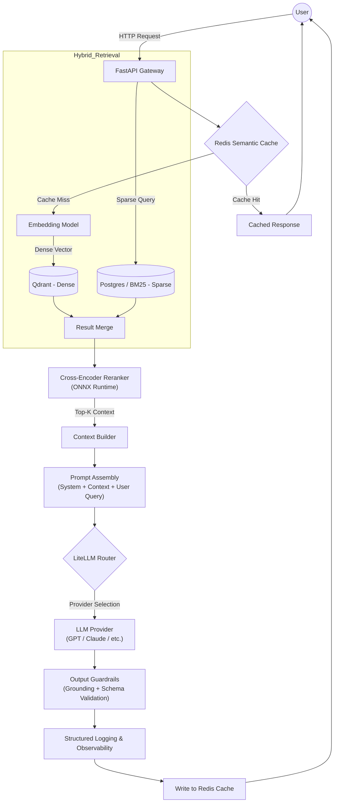

# 🚀 Hybrid RAG Template: Production-Grade RAG System (FastAPI + Qdrant + Redis)

[](https://hub.docker.com/r/yourusername/rag-app)

[](https://www.python.org/downloads/release/python-3120/)

[](https://fastapi.tiangolo.com/)

[](https://opensource.org/licenses/MIT)

A modular, high-performance Hybrid Retrieval-Augmented Generation (RAG) template built for evaluation, benchmarking, and production deployment. Optimized for low-latency hybrid search (dense + sparse), precise retrieval, and scalable AI infrastructure.

**Why use this?** Get a production-ready RAG setup with semantic caching, reranking, and LLM-as-judge evals — all in a lightweight Docker image (~1.08GB). Ideal for experimenting with RAG pipelines on real documents like 10-K reports. If you find it useful, star the repo! ⭐


## 🏗 Architecture Diagram




## 🔧 Tech Stack

- **API Framework**: FastAPI (async, production-ready)

- **Vector Database**: Qdrant (hybrid search support)

- **Caching**: Redis (semantic cache for queries/responses)

- **LLM Router**: LiteLLM (provider-agnostic, with logging)

- **Embeddings**: OpenAI Embeddings (configurable)

- **Reranker**: Cross-encoder models via FastEmbed (default: `jinaai/jina-reranker-v1-tiny-en`, ONNX-optimized)

- **Containerization**: Docker + Docker Compose


## 📦 Production Optimizations

- No PyTorch dependency (pure ONNX for reranker)

- Excluded Hugging Face cache from Docker layers

- Multi-stage Docker build for minimal footprint

- CPU-optimized inference (no GPU required)

- Built-in LLM-as-Judge evaluation for grounding checks

- Strict `.dockerignore` to avoid bloat

- Final image size: **~1.08GB**


## 🚀 Quick Start

**Prerequisites**: Docker and Docker Compose installed.

1. Clone the Repository

```bash
git clone https://github.com/rayxcast/hybrid-rag-template.git

cd hybrid-rag-template
```

2. Create `.env` File

```env
OPENAI_API_KEY=your_key_here

RETRIEVAL_MODE=hybrid  # or 'dense'

LLM_PROVIDER=openai

LLM_MODEL=gpt-5-nano  # Adjust as needed

EMBEDDING_MODEL=text-embedding-3-small

USE_RERANKER=true
```

3. Start Services

```bash
docker compose up --build
```

- API: http://localhost:8000 (try `/docs` for Swagger UI)

- Qdrant Dashboard: http://localhost:6333/dashboard

- Redis: localhost:6379 (use Redis Insight for monitoring)


## 🧪 Run Evaluation Suite

Evaluate retrieval, generation, and grounding on a 25-question benchmark (adversarial, unanswerable, etc.) using Alphabet 10-k Annual Report 2026 PDF (https://abc.xyz/investor/sec-filings/).

```bash
docker compose run --rm eval
```

**Outputs Include**:

- Retrieval recall/precision

- Latency breakdowns (retrieval, rerank, generation, judge)

- Pass/fail per case (96% accuracy achieved)

- Total execution time

Example: Achieves strict factual grounding with LLM-as-judge.


## 📊 Performance Benchmarks

Tested on 2.9 GHz 6-Core Intel Core i9 with 32 GB RAM (local CPU, no GPU).

| Stage  | Avg Time  |
|----------------|-----------|
| Retrieval  | ~0.67s |
| Rerank | ~1.03s |
| Generation | ~6.39s |
| Judge  | ~5.93s |
| End-to-End | ~12–15s (with eval judge), ~6–8s (production inference) |


## 🗂 Project Structure

```
hybrid-rag-template/

├── app/  # Core application code

│ ├── evaluation/ # Eval framework

│ │ ├── eval_dataset.py  # 25-question benchmark dataset

│ │ ├── evaluator.py # RAGEvaluator class with LLM-as-judge

│ │ └── run_eval.py  # Async eval runner

│ ├── rag/  # RAG pipeline components

│ │ ├── generator.py # LLM generation logic

│ │ ├── ingestion.py # Document ingestion to Qdrant

│ │ ├── pipeline.py  # HybridRAG orchestrator

│ │ ├── prompts.yaml # Prompt templates (e.g., QA)

│ │ ├── reranker.py  # Reranker class

│ │ └── retriever.py # Retriever class (hybrid/dense)

│ ├── api/  # API layer

│ │ └── endpoints/ # Routes

│ │ ├── ingest.py  # POST /ingest (upload files/dir)

│ │ └── query.py # POST /query {"query": "..."}

│ ├── utils/  # Helpers

│ │ ├── logging.py # Structured logging with structlog

│ │ └── cache.py # Redis semantic cache (query hashing)

│ ├── config.py # Pydantic settings and flags

│ └── main.py # FastAPI app entrypoint

├── data/ # Sample docs (e.g., alphabet_10k_report_2026.pdf)

├── .dockerignore

├── .gitignore

├── docker-compose.yml  # Services: app, Qdrant, Redis, eval

├── Dockerfile  # Optimized build

├── README.md

└── requirements.txt  # Pinned dependencies
```


## ⚙️ Configuration

Tune via `.env` or `config.py`:

- `RETRIEVAL_MODE`: 'hybrid' or 'dense'

- `LLM_PROVIDER`: 'openai', 'anthropic', etc.

- `LLM_MODEL`: e.g., 'gpt-5-nano'

- `EMBEDDING_MODEL`: e.g., 'text-embedding-3-small'

- `EMBED_BATCH_SIZE`: Batch size for embeddings

- `USE_RERANKER`: true/false

- `SIMILARITY_TOP_K`: Initial retrieval count

- `SIMILARITY_CUTOFF`: Score threshold

- `RERANK_MODEL`: e.g., 'jinaai/jina-reranker-v1-tiny-en'

- `RERANK_TOP_N`: Post-rerank selection

- `FINAL_CONTEXT_N`: Chunks in final prompt


## 🧠 Design Decisions

### Why FastEmbed for Reranker?

- Lightweight, fast, and CPU-efficient (ONNX runtime)

- Minimal accuracy trade-off vs. heavier models

- No PyTorch overhead


### Why Redis for Caching?

- Semantic caching reduces redundant LLM calls (hash(query) → response + context)

- High-speed, in-memory for low-latency hits


### Why LiteLLM?

- Abstracts LLM providers for easy switching

- Built-in logging and cost tracking

- Production-grade error handling


### Why LLM-as-Judge for Eval?

- Context-aware metrics (e.g., grounding, completeness)

- Scalable, cost-effective, and explainable

- Achieves 96% accuracy on custom benchmarks


## 🐳 Docker Notes

- Multi-stage build for slim runtime image

- Non-root user for security

- No cached artifacts in final layers


Build manually:

```bash
docker build -t rag-app .
docker images  # Verify size
```


## 🧪 Scaling Strategy

- Scale FastAPI with replicas (e.g., via Kubernetes)

- Use managed Qdrant Cloud for distributed search

- Enable Redis clustering for cache

- Add async response streaming

- Deploy with NGINX or cloud LB for traffic


## 🚀 Roadmap / Future Enhancements

- Rate limiting middleware

- Health check endpoints

- CI/CD with benchmark reports

- Observability (Sentry/Prometheus)

- Authentication layer (API keys/JWT)


## 🤝 Contributing

Contributions welcome! Fork the repo, create a feature branch, and submit a PR. Follow standard Python/PEP8 style.


## 📝 License

MIT


## 👤 Author

Built by Randy Castillo ([https://github.com/rayxcast](https://github.com/rayxcast)) – Applied AI Engineer specializing in production LLM systems.
