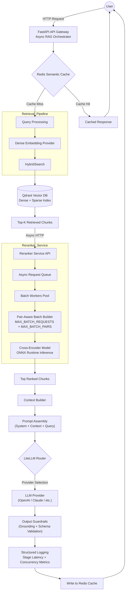

# 🚀 Hybrid RAG Template: Production-Grade RAG System (FastAPI + Qdrant + Redis)

[](https://www.python.org/downloads/release/python-3120/)

[](https://fastapi.tiangolo.com/)

[](https://opensource.org/licenses/MIT)

A modular, high-performance Hybrid Retrieval-Augmented Generation (RAG) template built for evaluation, benchmarking, and production deployment. Optimized for low-latency hybrid search (dense + sparse), precise retrieval, and scalable AI infrastructure.

**Why use this?** Get a production-ready RAG setup with semantic caching, reranking, and LLM-as-judge evals. Ideal for experimenting with RAG pipelines on real documents like 10-K reports. If you find it useful, star the repo! ⭐


## 🏗 Architecture Diagram


```mermaid
flowchart TD

%% Entry Layer
User((User))
User -->|HTTP Request| API[FastAPI API Gateway<br/>Async RAG Orchestrator]

%% Cache Layer
API --> CacheCheck{Redis Semantic Cache}
CacheCheck -->|Cache Hit| CachedResponse[Cached Response]
CachedResponse --> User
CacheCheck -->|Cache Miss| Retrieval

%% Retrieval Layer
subgraph Retrieval_Pipeline
Retrieval[Query Processing]
Retrieval --> Embed[Dense Embedding Provider]
Embed --> HybridSearch
end

%% Vector Database
HybridSearch --> Qdrant[(Qdrant Vector DB<br/>Dense + Sparse Index)]

Qdrant --> Candidates[Top-K Retrieved Chunks]

%% Reranker Microservice
Candidates -->|Async HTTP| RerankerAPI[Reranker Service API]

subgraph Reranker_Service
RerankerAPI --> BatchQueue[Async Request Queue]
BatchQueue --> BatchWorkers[Batch Workers Pool]
BatchWorkers --> BatchBuilder[Pair-Aware Batch Builder<br/>MAX_BATCH_REQUESTS + MAX_BATCH_PAIRS]
BatchBuilder --> CrossEncoder[Cross-Encoder Model<br/>ONNX Runtime Inference]
end

CrossEncoder --> Ranked[Top Ranked Chunks]

%% Context Assembly
Ranked --> Context[Context Builder]

%% Prompt Layer
Context --> Prompt["Prompt Assembly<br/>(System + Context + Query)"]

%% LLM Router
Prompt --> Router{LiteLLM Router}

Router -->|Provider Selection| LLM["LLM Provider<br/>(OpenAI / Claude / etc.)"]

%% Post Processing
LLM --> Guardrails["Output Guardrails<br/>(Grounding + Schema Validation)"]

%% Observability
Guardrails --> Logger["Structured Logging<br/>Stage Latency + Concurrency Metrics"]

Logger --> CacheWrite[Write to Redis Cache]

CacheWrite --> User
```

## 🚨 Embedding Model

If embedding model changes, you must:
- Set the correct dimension size for the embedding model (EMBEDDING_DIM) 
- Recreate collection
- Re-ingest documents


## 🔧 Tech Stack

- **API Framework**: FastAPI (async, production-ready)

- **Vector Database**: Qdrant (hybrid search support)

- **Caching**: Redis (semantic cache for queries/responses)

- **LLM Router**: LiteLLM (provider-agnostic, with logging)

- **Embeddings**: OpenAI Embeddings (configurable)

- **Reranker**: Cross-encoder models via FastEmbed (default: `jinaai/jina-reranker-v1-tiny-en`, ONNX-optimized)

- **Containerization**: Docker + Docker Compose


## 📦 Production Optimizations

- No PyTorch dependency (pure ONNX for reranker)

- Excluded Hugging Face cache from Docker layers

- Multi-stage Docker build for minimal footprint

- CPU-optimized inference (no GPU required)

- Built-in LLM-as-Judge evaluation for grounding checks

- Strict `.dockerignore` to avoid bloat

## 🚀 Quick Start

**Prerequisites**: Docker and Docker Compose installed.

1. Clone the Repository

```bash
git clone https://github.com/rayxcast/hybrid-rag-template.git

cd hybrid-rag-template
```

2. Install dependencies (uv recommended)

# For the main app + evaluation
```bash
uv sync  # installs from pyproject.toml + creates uv.lock
```

# For the reranker microservice
```bash
uv sync --directory services/reranker_service
```

3. Create `.env` File

```env
OPENAI_API_KEY=your_key_here

RETRIEVAL_MODE=hybrid  # or 'dense'
```

4. Start with Docker Compose (recommended)

```bash
docker compose up --build
```

- API: http://localhost:8000 (try `/docs` for Swagger UI)

- Qdrant Dashboard: http://localhost:6333/dashboard

- Redis: localhost:6379 (use Redis Insight for monitoring)


## 🧪 Run Evaluation Suite

Evaluate retrieval, generation, and grounding on a 25-question benchmark (adversarial, unanswerable, etc.) using Alphabet 10-k Annual Report 2026 PDF (https://abc.xyz/investor/sec-filings/).

```bash
docker compose run --rm eval
```

**Outputs Include**:

- Retrieval recall/precision

- Latency breakdowns (retrieval, rerank, generation, judge)

- Pass/fail per case (96% accuracy achieved)

- Total execution time

Example: Achieves strict factual grounding with LLM-as-judge.


## 📊 Performance Benchmarks

Evaluated in a Docker container (Linux x86_64 emulation) on host:
- MacBook Pro (2.9 GHz 6-Core Intel Core i9, 32 GB RAM)
- Local CPU only (no GPU acceleration)

**LLM models**:
- Generation: OpenAI gpt-4.1-mini
- Judge: OpenAI gpt-4.1-nano

**Retrieval config**:
- Chunk size: 512 tokens
- Similarity top-k: 75
- Similarity cutoff: 0.75

**Reranker config**:
- Model: fastembed / jinaai/jina-reranker-v1-tiny-en
- Rerank top-n: 25
- Final context chunks: 7

**Test suite** (25 cases total):
- 5 adversarial
- 5 unanswerable
- 5 paraphrased
- 5 multi-hop
- 5 numerical precision

**Results** (March 2026 run):

| Metric                  | Value                  |
|-------------------------|------------------------|
| Total Accuracy (judge-passed) | 100.00%               |
| Avg Retrieval Time      | ~1.91 s                |
| Avg Rerank Time         | ~4.38 s                |
| Avg Generation Time     | ~2.06 s                |
| Avg Judge Time          | ~1.87 s                |
| End-to-End Latency (with judge) | ~9–11 s             |
| End-to-End Latency (inference only) | ~6–9 s           |

This 100% judge-pass rate demonstrates strong faithfulness and precision across diverse question types, even on CPU-only hardware. Latencies are dominated by the reranker (CPU-bound); production deployments with GPU or lighter rerank could reduce total time significantly.


## 🗂 Project Structure

```
└── 📁hybrid-rag-template
    └── 📁app
        └── 📁api
            └── 📁endpoints
                ├── ingest.py
                ├── query.py
        └── 📁core
            └── 📁observability
                ├── timing.py
        └── 📁evaluation
            ├── eval_dataset.py
            ├── evaluator.py
            ├── run_eval.py
        └── 📁rag
            └── 📁embedding_providers
                └── 📁dense
                    ├── base.py
                    ├── factory.py
                    ├── openai_provider.py
                └── 📁sparse
                    ├── base.py
                    ├── factory.py
                    ├── splade_provider.py
            └── 📁reranker_providers
                ├── base.py
                ├── factory.py
                ├── fastembed_reranker.py
                ├── remote_reranker.py
            └── 📁vectorstores
                ├── base.py
                ├── factory.py
                ├── qdrant_hybrid.py
            ├── generator.py
            ├── hybrid_indexer.py
            ├── ingestion.py
            ├── pipeline.py
            ├── prompts.yaml
            ├── retriever.py
        └── 📁utils
            ├── cache.py
            ├── logging.py
        ├── config.py
        ├── main.py
    └── 📁data
    └── 📁eval_results
        ├── eval_results.json
    └── 📁services
        └── 📁reranker_service
            └── 📁app
                ├── config.py
                ├── main.py
            ├── .dockerignore
            ├── Dockerfile
            ├── pyproject.toml
            ├── uv.lock
    ├── .dockerignore
    ├── .gitignore
    ├── docker-compose.yml
    ├── Dockerfile
    ├── LICENSE
    ├── pyproject.toml
    ├── README.md
    └── uv.lock
```

## ⚙️ Configuration

Tune via `.env` or `config.py`:

RAG Settings
- `RETRIEVAL_MODE`
- `LLM_PROVIDER`
- `LLM_MODEL`
- `USE_RERANKER`
- `USE_CACHE`

Dense provider
- `DENSE_PROVIDER`
- `EMBEDDING_MODEL`
- `EMBED_BATCH_SIZE`

- `CHUNK_SIZE`
- `CHUNK_OVERLAP`
- `EMBEDDING_DIM`

Sparse provider
- `SPARSE_PROVIDER`
- `SPARSE_MODEL`

Reranker provider
- `RERANKER_PROVIDER`
- `RERANKER_MODEL`

Retrieval config
- `SIMILARITY_TOP_K`
- `SIMILARITY_CUTOFF`
- `RERANK_TOP_N`
- `FINAL_CONTEXT_N`
    
Evals config
- `EVAL_LLM_MODEL`
- `EVAL_LLM_PROVIDER`


## 🧠 Design Decisions

### Why FastEmbed for Reranker?

- Lightweight, fast, and CPU-efficient (ONNX runtime)

- Minimal accuracy trade-off vs. heavier models

- No PyTorch overhead

### Top FastEmbed Rerank Models

| Model | Size | Speed | Quality (approx. relative) | Multilingual | License | Best for |
| :--- | :--- | :--- | :--- | :--- | :--- | :--- |
| Xenova/ms-marco-MiniLM-L-6-v2 | ~80 MB | Very fast | Good / baseline | English-focused | Apache 2.0 | Latency-critical, small infra |
| Xenova/ms-marco-MiniLM-L-12-v2 | ~120 MB | Fast | Good+ | English-focused | Apache 2.0 | Slightly better quality, still fast |
| jinaai/jina-reranker-v1-tiny-en | ~130 MB | Very fast | Good | English | Apache 2.0 | Ultra-low latency English |
| jinaai/jina-reranker-v1-turbo-en | ~150 MB | Fast | Good+ | English | Apache 2.0 | Fast English with better quality |
| BAAI/bge-reranker-base | ~1.04 GB | Medium | Very good | Strong multi | MIT | Balanced production choice |
| jinaai/jina-reranker-v2-base-multilingual | ~1.1 GB | Medium | Excellent | Very strong | CC-BY-NC-4.0 | Multilingual production (non-commercial only if strict) |


### Why Redis for Caching?

- Semantic caching reduces redundant LLM calls (hash(query) → response + context)

- High-speed, in-memory for low-latency hits


### Why LiteLLM?

- Abstracts LLM providers for easy switching

- Built-in logging and cost tracking

- Production-grade error handling


### Why LLM-as-Judge for Eval?

- Context-aware metrics (e.g., grounding, completeness)

- Scalable, cost-effective, and explainable

- Achieves 100% accuracy on custom benchmarks


## 🐳 Docker Notes

- Multi-stage build for slim runtime image

- Non-root user for security

- No cached artifacts in final layers


Build manually:

```bash
docker build -t rag-app .
docker images  # Verify size
```


## 🧪 Scaling Strategy

- Scale FastAPI with replicas (e.g., via Kubernetes)

- Use managed Qdrant Cloud for distributed search

- Enable Redis clustering for cache

- Add async response streaming

- Deploy with NGINX or cloud LB for traffic


## 🚀 Roadmap / Future Enhancements

- Rate limiting middleware

- Health check endpoints

- CI/CD with benchmark reports

- Observability (Sentry/Prometheus)

- Authentication layer (API keys/JWT)


## 🤝 Contributing

Contributions welcome! Fork the repo, create a feature branch, and submit a PR. Follow standard Python/PEP8 style.


## 📝 License

MIT


## 👤 Author

Built by Randy Castillo ([GitHub](https://github.com/rayxcast), [LinkedIn](https://www.linkedin.com/in/randycastillo-/)).
