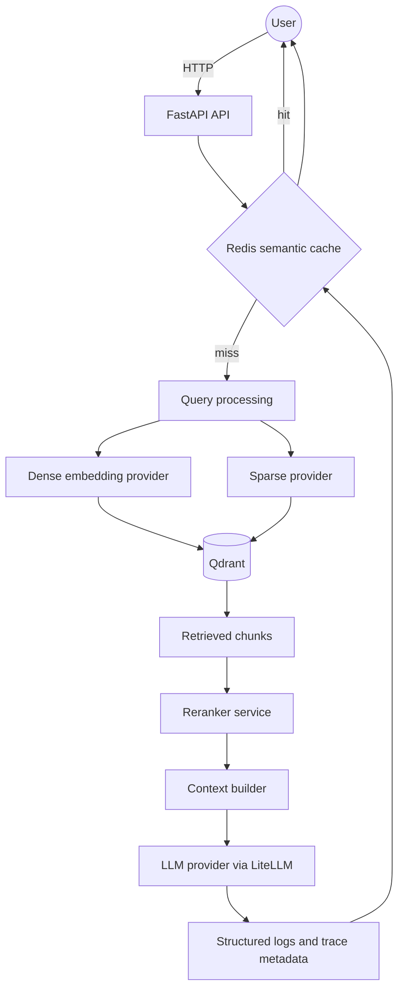

# Hybrid RAG Template

[](https://www.python.org/downloads/release/python-3120/)
[](https://fastapi.tiangolo.com/)
[](https://opensource.org/licenses/MIT)

A production-oriented Retrieval-Augmented Generation template built with FastAPI, Qdrant,
Redis semantic caching, LiteLLM, and a standalone FastEmbed reranker service.

**Why use this?** Get a production-ready RAG setup with semantic caching, reranking, and LLM-as-judge evals.

## 🏗 Architecture Diagram


```mermaid
flowchart TD
    User((User)) -->|HTTP| API[FastAPI API]
    API --> Cache{Redis semantic cache}
    Cache -->|hit| User
    Cache -->|miss| Retrieval[Query processing]
    Retrieval --> Dense[Dense embedding provider]
    Retrieval --> Sparse[Sparse provider]
    Dense --> Qdrant[(Qdrant)]
    Sparse --> Qdrant
    Qdrant --> Candidates[Retrieved chunks]
    Candidates --> Reranker[Reranker service]
    Reranker --> Context[Context builder]
    Context --> LLM[LLM provider via LiteLLM]
    LLM --> Logs[Structured logs and trace metadata]
    Logs --> Cache
    Cache --> User
```

## Stack

- FastAPI API and lightweight demo UI
- Qdrant for dense and sparse vector search
- Redis Stack for semantic response caching
- LiteLLM for OpenAI, Anthropic, Google, and other providers
- FastEmbed ONNX reranker in a separate FastAPI service
- Docker Compose for local and deployment-like testing
- `uv` for Python dependency management

## Prerequisites

- Python 3.12
- `uv`
- Docker Compose

On macOS, OrbStack is recommended for running this project locally. It has been the most
reliable option for this template on Mac development machines, especially when building
and running the multi-service Docker stack. Docker Desktop should also work.

## Quick Start

Clone the repository:

```bash
git clone https://github.com/rayxcast/hybrid-rag-template.git
cd hybrid-rag-template
```

Create your environment file:

```bash
cp .env.example .env
```

Edit `.env` and set at least one provider key. For OpenAI:

```env
OPENAI_API_KEY=your_openai_key
LLM_PROVIDER=openai
LLM_MODEL=gpt-4.1-mini
DENSE_PROVIDER=openai
EMBEDDING_MODEL=text-embedding-3-small
EMBEDDING_DIM=1536
RETRIEVAL_MODE=hybrid
```

Start the stack:

```bash
docker compose up --build
```

Open:

- Demo UI: http://localhost:8000/
- Swagger UI: http://localhost:8000/docs
- Status endpoint: http://localhost:8000/status/

Follow logs:

```bash
docker compose logs -f app reranker_service
```

Stop the stack:

```bash
docker compose down
```

To remove local Qdrant and Redis data volumes too:

```bash
docker compose down -v
```

## Demo Workflow

The demo UI supports a simple upload, ingest, and ask flow:

- Upload a PDF, TXT, or Markdown file.
- Optionally select **Reset index before ingesting** to recreate the Qdrant collection.
- Click **Ingest document**.
- Ask questions once the index is ready.

The UI calls these API routes:

- `POST /ingest/` with multipart form data containing `file` and `recreate`
- `POST /query/` with JSON shaped like `{ "query": "..." }`
- `GET /status/` to check collection and index readiness

By default, ingestion accepts uploaded `.pdf`, `.txt`, and `.md` files. Ingesting an
arbitrary path from inside the container is disabled unless `ALLOW_PATH_INGEST=true`.
This keeps the default API safer for teams adapting the template.

Large PDFs can take time to ingest because embedding, sparse vector generation, and
indexing are CPU and network intensive.

## Gemini Demo Mode

You can run the same stack with Google AI Studio / Gemini instead of OpenAI.

Recommended `.env` values:

```env
GOOGLE_API_KEY=your_google_ai_studio_key

LLM_PROVIDER=google
LLM_MODEL=gemini-2.5-flash
LLM_MAX_TOKENS=2048
LLM_CONTEXT_WINDOW=1000000

DENSE_PROVIDER=google
EMBEDDING_MODEL=gemini-embedding-2
EMBEDDING_DIM=1536
EMBED_BATCH_SIZE=100

RETRIEVAL_MODE=hybrid
```

When switching embedding providers, models, or dimensions:

- Recreate or rename the Qdrant collection.
- Re-ingest documents.
- Clear Redis or set `USE_CACHE=false`.

Embedding spaces are not interchangeable, and semantic cache vectors are provider-specific.

## Docker Notes

The default Compose file is production-style rather than hot-reload development mode:

- `app` is exposed on `localhost:8000`.
- Qdrant, Redis, and the reranker service are internal-only by default.
- Qdrant and Redis use named volumes for persistence.
- The app and reranker images run as a non-root user.
- App and service containers include healthchecks.

To inspect Qdrant or Redis from the host during local debugging, temporarily add port
mappings or use a Compose override file. For example:

```yaml
services:
  qdrant:
    ports:
      - "6333:6333"
  redis:
    ports:
      - "6379:6379"
  reranker_service:
    ports:
      - "8001:8001"
```

Then open the Qdrant dashboard at:

```text
http://localhost:6333/dashboard
```

Build images manually:

```bash
docker compose build app reranker_service
```

Validate Compose configuration:

```bash
docker compose config
```

Important: `docker compose config` expands values from `.env`, including API keys. Do
not paste its full output into issues, chats, logs, or documentation.

## Local Python Development

Install main app dependencies:

```bash
uv sync
```

Install reranker service dependencies:

```bash
uv sync --directory services/reranker_service
```

Run lint checks:

```bash
uv run ruff check .
```

Run tests:

```bash
uv run python -m pytest
```

If local `uv` commands fail because `.venv` points to an old checkout path, recreate the
environment:

```bash
rm -rf .venv
uv sync
```

## Evaluation

Run the evaluation job through Docker:

```bash
docker compose run --rm eval
```

Evaluation outputs include retrieval metrics, generation/judge latency, per-case results,
and a JSON report under `eval_results/`.

## Configuration

Configuration is loaded from `.env` through `app/config.py`.

Common settings:

- `LOG_LEVEL`
- `LOG_FORMAT`
- `RETRIEVAL_MODE`
- `LLM_PROVIDER`
- `LLM_MODEL`
- `LLM_MAX_TOKENS`
- `LLM_CONTEXT_WINDOW`
- `DENSE_PROVIDER`
- `EMBEDDING_MODEL`
- `EMBEDDING_DIM`
- `EMBED_BATCH_SIZE`
- `USE_RERANKER`
- `USE_CACHE`
- `QDRANT_URL`
- `REDIS_URL`
- `RERANKER_URL`
- `COLLECTION_NAME`
- `ALLOW_PATH_INGEST`
- `MAX_UPLOAD_BYTES`
- `ALLOWED_UPLOAD_EXTENSIONS`
- `QUERY_MAX_CHARS`

Default Docker service URLs:

```env
QDRANT_URL=http://qdrant:6333
REDIS_URL=redis://redis:6379/0
RERANKER_URL=http://reranker:8001
```

## Production Readiness

This repository is structured as a production-oriented template, but the default API is
not a complete secured production deployment by itself.

Already included:

- Multi-stage Docker builds
- Non-root application containers
- Internal service networking by default
- Pinned stateful service image tags
- Structured request logging with request IDs
- Redis semantic cache
- Qdrant persistence through named volumes
- Reranker service isolation
- Upload extension and size validation
- Query length validation
- Path ingestion disabled by default
- Baseline tests and focused CI for safety-critical API surfaces

Recommended before internet-facing production use:

- Add authentication or API-key middleware.
- Add rate limits and request size limits.
- Expand file validation beyond extension checks if handling untrusted uploads.
- Expand unit/integration coverage around retrieval, generation, and eval flows.
- Add metrics, dashboards, and deployment runbooks.
- Publish versioned application images from CI.

## Project Structure

```text
app/
  api/endpoints/        FastAPI routes
  core/observability/   Timing helpers
  evaluation/           Evaluation dataset and runner
  rag/                  Retrieval, generation, embedding, reranking, vector store logic
  static/               Demo UI
  utils/                Logging and cache helpers
services/
  reranker_service/     Standalone FastAPI reranker service
Dockerfile              Main API image
docker-compose.yml      Multi-service runtime
pyproject.toml          Main app dependencies and tooling
```

## Troubleshooting

If the app starts but queries fail, check provider credentials and model names in `.env`.

If ingestion succeeds but retrieval looks wrong after changing embedding settings, recreate
the collection, clear Redis, and re-ingest documents.

If Docker builds are flaky on macOS, try OrbStack and rebuild:

```bash
docker compose build --no-cache app reranker_service
docker compose up
```

If Redis or Qdrant state looks stale:

```bash
docker compose down -v
docker compose up --build
```

## Roadmap

- CI with lint, tests, and Docker build checks
- API authentication and rate limiting
- Upload size/type validation
- Production metrics and tracing
- Deployment examples for managed Qdrant and Redis
- Versioned image publishing

## License

MIT

## Author

Built by Randy Castillo ([GitHub](https://github.com/rayxcast), [LinkedIn](https://www.linkedin.com/in/randycastillo-/)).
